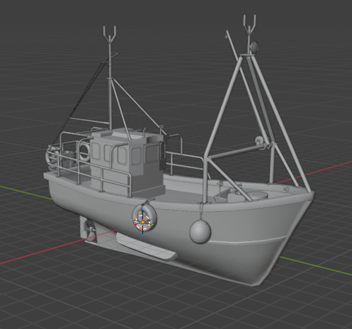
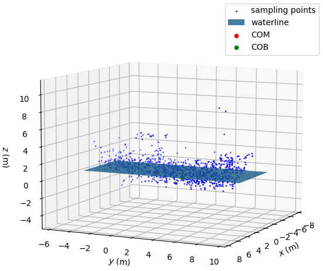
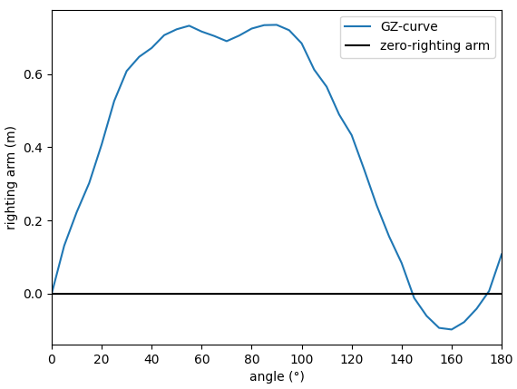

# gzpy

A Python library to compute and analyze GZ curves (stability curves) for marine vessels.

## Implementation

```gzpy``` uses a Monte-Carlo approach to approximate the vessel's mesh using randomly sampled points within its volume. Increasing the quantity of sampled points will improve the accuracy of the computed GZ-curve at the cost of increased computational effort.


## Usage and Example

The following figures were generated using ```examples/demo.py``` for the "Fishing Boat" sample model.

For the "Fishing Boat" sampled model, shown below in Blender,


```gzpy``` computed the following sampling point approximation of the hull using 1000 points, and used them to compute the GZ-curve.





## Notes

```gzpy``` assumes the provided mesh is manifold, and has a defined volume. Improper meshes may produce unexpected behaviour.


## Conventions

### Coordinate System

This package assumes right-handed coordinates and the following conventions,
- the $x$-axis corresponds to sway (pitch axis),
- the $y$-axis corresponds to surge (roll axis), and
- the $z$-axis corresponds to heave (yaw axis)

Because of the right-handed coordinate system,
- $+x$ indicates moving starboard,
- $+y$ indicates moving forward, and
- $+z$ indicates increasing elevation

### Center of Mass (COM)

COM location $(x,y,z)$ must be supplied relative to the origin of the mesh.

### Units

All arguments must be given in SI units.


## Information

### License

This project is licensed under the **Apache License 2.0** - see the [LICENSE](LICENSE) file for details.

### Contributing

Open-source contributions are welcome. Please report an issue or submit a pull request.

### Citation

If you use ```gzpy``` in your work, please cite it as below:

```BibTex
@software{gzpy,
    author = {Cain, Nolan},
    license = {Apache-2.0},
    title = {{gzpy}},
    url = {https://github.com/nolan-sldprt/gzpy},
    version = {0.1.0},
}
```

### Third-Party 3D Models

Third-party 3D models, that are not licensed under Apache-2.0, are included as example data to demonstrate ```gzpy```'s capabilities. For information on their attributions and licensing, see [ATTRIBUTIONS.md](ATTRIBUTIONS.md).