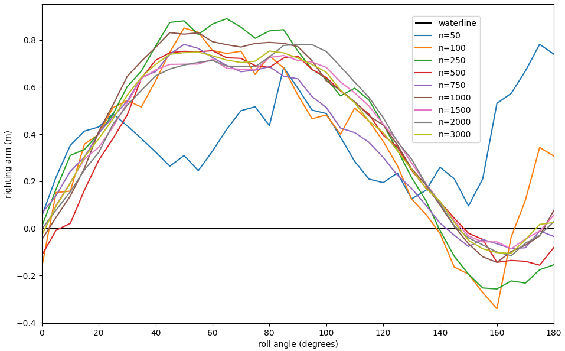
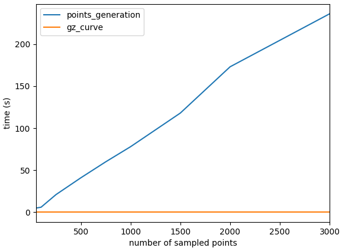

# gzpy

A Python library to compute and analyze GZ curves (stability curves) for marine vessels.

The vessel's geometry must be supplied as a wavefront (```.obj```) file.


## Implementation

```gzpy``` uses a Monte-Carlo approach to approximate the vessel's mesh using randomly sampled points within its volume. Increasing the quantity of sampled points will improve the accuracy of the computed GZ-curve at the cost of increased computational effort.


## Usage and Examples

The following figures were generated using ```examples/demo.py``` for the "Fishing Boat" sample model.

For the "Fishing Boat" model, shown below in Blender,


```gzpy``` computed the following sampling point approximation of the hull using 1000 points, and used them to compute the GZ-curve.

 

### Convergence

As the number of sampled points increases, it asymptotically approaches the exact model of the vessel.
Consequently, the approximated GZ-curve also approaches the exact GZ-curve as the number of sampled points approaches infinity, at the cost of increased computational effort. The following example figures for the "Fishing Boat" model demonstrate convergence of the approximated GZ-curves as the number of sampled points increases, and the increased computation time on an Intel i9 CPU with 32 GB of RAM.




As shown above, the majority of computation time is spent sampling points within the vessel, and relatively little time is spent computing the GZ-curve using these sampled points.


## Notes

```gzpy``` assumes the provided mesh is manifold, and has a defined volume. Improper meshes may produce unexpected behaviour.

The provided examples and sample data do not reflect vessels, masses, or COM locations. The meshes and values used in the examples are for demonstration only.


## Conventions

### Coordinate System

This package assumes right-handed coordinates and the following conventions,
- the $x$-axis corresponds to sway (pitch axis),
- the $y$-axis corresponds to surge (roll axis), and
- the $z$-axis corresponds to heave (yaw axis)

Because of the right-handed coordinate system,
- $+x$ indicates moving starboard,
- $+y$ indicates moving forward, and
- $+z$ indicates increasing elevation

### Center of Mass (COM)

COM location $(x,y,z)$ must be supplied relative to the origin of the mesh.

### Units

All arguments must be given in SI units.


## Information

### License

This project is licensed under the **Apache License 2.0** - see the [LICENSE](LICENSE) file for details.

### Contributing

Open-source contributions are welcome. Please report an issue or submit a pull request.

### Citation

If you use ```gzpy``` in your work, please cite it as below:

```BibTex
@software{gzpy,
    author = {Cain, Nolan},
    license = {Apache-2.0},
    title = {{gzpy}},
    url = {https://github.com/nolan-sldprt/gzpy},
    version = {0.1.0},
}
```

### Third-Party 3D Models

Third-party 3D models, that are not licensed under Apache-2.0, are included as example data to demonstrate ```gzpy```'s capabilities. For information on their attributions and licensing, see [ATTRIBUTIONS.md](ATTRIBUTIONS.md).
